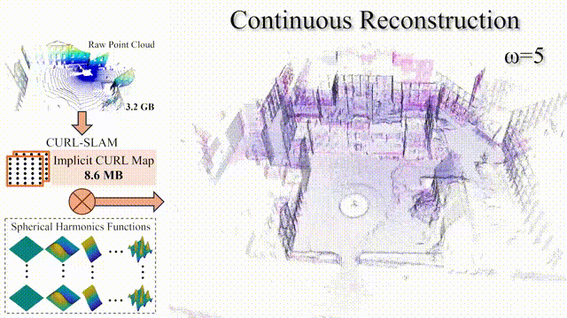
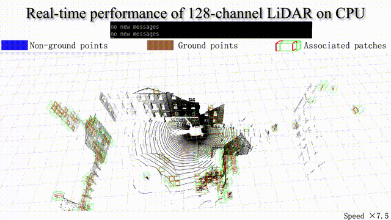
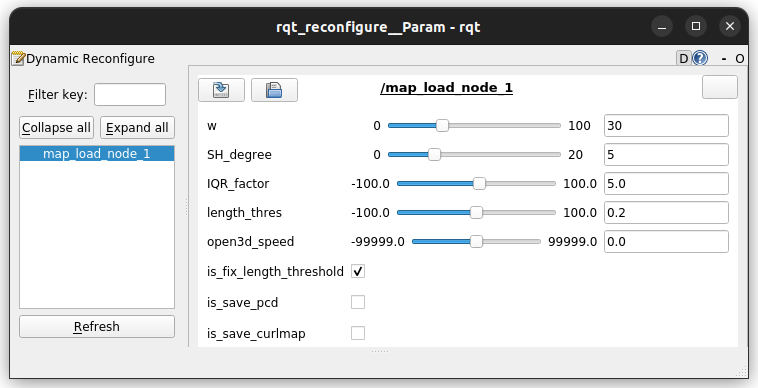
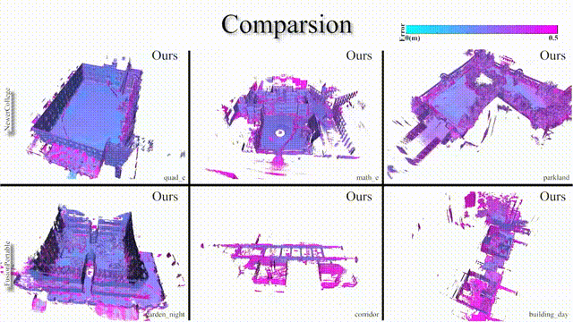

# CURL-SLAM

**CURL-SLAM: Continuous and Compact LiDAR Mapping (T-RO 2025)**
> CURL-SLAM is a real-time, CPU-based LiDAR mapping system that utilizes spherical harmonics to generate an ultracompact, globally consistent, and continuously reconstructible 3D map.

Paper: https://ieeexplore.ieee.org/document/11078155/


<p align="center">
  
</p>

---

## Table of Contents
- [System Requirements](#system-requirements)
- [Quick Start (Docker)](#quick-start-docker)
  - [Docker (CPU/GPU)](#docker-cpugpu)
- [Run Demos](#run-demos)
- [Datasets](#datasets)
- [Configuration](#configuration)
- [Results](#results)
- [Citation](#citation)
- [License](#license)
- [Acknowledgements](#acknowledgements)
- [Appendix: Common compose commands](#appendix-common-compose-commands)

---

## System Requirements

### Host (recommended)
- Ubuntu 22.04 / 24.04 tested; base image is ROS Noetic on Ubuntu 20.04
- Docker Engine + Compose plugin (`docker compose` works):
  https://docs.docker.com/engine/install/ubuntu/

### GPU (optional)
- GPU only improves 3D visualization performance; the core SLAM pipeline runs on CPU.
- NVIDIA driver installed (`nvidia-smi` works)
- NVIDIA Container Toolkit installed:
  https://docs.nvidia.com/datacenter/cloud-native/container-toolkit/latest/install-guide.html

---

## Quick Start (Docker)

### 0) Clone
```bash
git clone https://github.com/SenseRoboticsLab/CURL-SLAM.git
cd CURL-SLAM
```

### 2) X11 (GUI) setup on the host (RViz, etc.)

```bash
xhost +si:localuser:root
```

If `echo $DISPLAY` changes, re-run the same `docker compose -f ... down` and `up` command you used to start the container.

---

## Docker (CPU/GPU)

CPU/GPU (replace `cpu` with `gpu` if needed):

```bash
sudo -E HOME=$HOME docker compose -f docker/docker-compose.cpu.yaml up --build -d

# Terminal 1
sudo docker compose -f docker/docker-compose.cpu.yaml exec curl_slam /bin/bash

# Terminal 2
sudo docker compose -f docker/docker-compose.cpu.yaml exec curl_slam /bin/bash
```

If you run Docker without `sudo`, drop `sudo -E HOME=$HOME`. The `HOME=$HOME` part keeps the correct host
`.Xauthority` when using `sudo`.

Optional data mount (edit `docker/.env` first):

```env
HOST_DATA_DIR=/path/on/host  # optional
```

`--env-file` is only needed for `up`/`build`. `exec` does not require it.

```bash
sudo -E HOME=$HOME docker compose --env-file docker/.env \
  -f docker/docker-compose.cpu.yaml -f docker/docker-compose.cpu.data.yaml up --build -d

# Terminal 1
sudo docker compose -f docker/docker-compose.cpu.yaml exec curl_slam /bin/bash

# Terminal 2
sudo docker compose -f docker/docker-compose.cpu.yaml exec curl_slam /bin/bash
```

Stop (Run this after you finish the demo to stop and remove the container.):

```bash
sudo docker compose -f docker/docker-compose.cpu.yaml down
```


---

## Run Demos

<p align="center">
  
</p>

Terminal 1 (mapping):
```bash
roslaunch curl_slam curl_slam.launch
```

Terminal 2 (play bag):
```bash
rosbag play <PATH_TO_BAG>
```

After mapping finishes, load the saved map and adjust resolution:
```bash
roslaunch curl_slam curl_map_load.launch
```

<p align="center">
  
</p>
<p align="center">GUI for adjusting reconstruction parameters in real time.</p>

Dynamic parameters (rqt_reconfigure):
- `w`: patch image resolution; higher = denser.
- `SH_degree`: spherical harmonics degree; higher = more detail.
- `IQR_factor`: IQR-based cutoff used when `is_fix_length_threshold` is false.
- `length_thres`: fixed continuity threshold; gaps larger than this are treated as holes and removed when `is_fix_length_threshold` is true.
- `open3d_speed`: visualization rotation speed; display only.
- `is_fix_length_threshold`: toggle fixed `length_thres` vs. IQR thresholding.
- `is_save_pcd`: save reconstructed map point cloud to `results_dir/final_map`.
- `is_save_curlmap`: save curl map to `results_dir/final_map`.

---

## Datasets

Sample Newer College rosbags (multi-cam): https://ori-drs.github.io/newer-college-dataset/multi-cam/
- https://drive.google.com/file/d/1wRnRSni9bcBRauJEJ80sxHIaJaonrC3C/view
- https://drive.google.com/file/d/1ORkYwGpQNvD48WRXICDDecbweg8MxYA8/view

Quick download with `gdown` (inside container):
```bash
gdown --id 1wRnRSni9bcBRauJEJ80sxHIaJaonrC3C
gdown --id 1ORkYwGpQNvD48WRXICDDecbweg8MxYA8
```

These are rosbags, so you can play them directly:
```bash
ls *.bag
rosbag play ./<bag_file>.bag
```

---
## YAML parameters
Primary configs live in:
- `config/config.yaml`
- `config/config_small.yaml`
- `config/config_middle.yaml`
- `config/config_challenge.yaml`
- `config/config_light.yaml`

---

## Results

<p align="center">
  
</p>

## Citation

```bibtex
@ARTICLE{11078155,
  author = {Zhang, Kaicheng and Xu, Shida and Ding, Yining and Kong, Xianwen and Wang, Sen},
  journal = {IEEE Transactions on Robotics},
  title = {CURL-SLAM: Continuous and Compact LiDAR Mapping},
  year = {2025},
  volume = {41},
  pages = {4538-4556},
  doi = {10.1109/TRO.2025.3588442}
}
```

---

## License

This project is licensed under GPL-3.0. See `LICENSE`. Third-party notices are listed in
`THIRD_PARTY_NOTICES.md`.

---

## Appendix: Common compose commands

```bash
# replace cpu with gpu if needed
sudo -E HOME=$HOME docker compose -f docker/docker-compose.cpu.yaml up --build -d
sudo -E HOME=$HOME docker compose -f docker/docker-compose.cpu.yaml exec curl_slam /bin/bash
sudo docker compose -f docker/docker-compose.cpu.yaml logs -f
sudo docker compose -f docker/docker-compose.cpu.yaml ps
sudo docker compose -f docker/docker-compose.cpu.yaml stop
sudo docker compose -f docker/docker-compose.cpu.yaml start
sudo docker compose -f docker/docker-compose.cpu.yaml down
```
